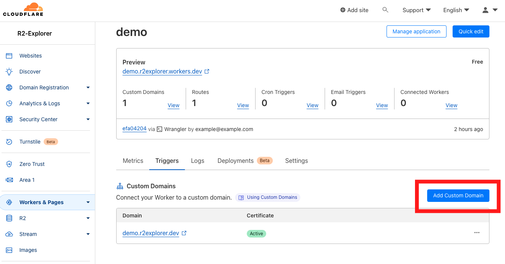

All customizations are applied in the `src/index.ts` file.

Here is all the available options:

| Name               | Type(s)                   | Description                                                                                                                                   | Examples                                                  |
|--------------------|---------------------------|-----------------------------------------------------------------------------------------------------------------------------------------------|-----------------------------------------------------------|
| `readonly`         | `boolean` or `undefined`  | Controls the write access globally, default: `true`                                                                                           | `true`                                                    |
| `cors`             | `boolean` or `undefined`  | Enables or disables CORS access to the internal API, default: `false`                                                                         | `true`                                                    |
| `cfAccessTeamName` | `string`  or `undefined`  | When set enforces Cloudflare Access in all requests                                                                                           | `radar`  (taken from https://radar.cloudflareaccess.com/) |
| `dashboardUrl`     | `string`  or `undefined`  | Allows you to serve a custom dashboard, read more [here](../guides/migrating-to-1.0.md/#why-is-the-dashboard-no-longer-bundled-in-the-worker) | `https://demo.r2explorer.com`                             |
| `emailRouting`     | `object`  or `undefined`  | Customize Email Explorer, read more [here](../guides/setup-email-explorer.md)                                                                 | `https://demo.r2explorer.com`                             |
| `cacheAssets`      | `boolean`  or `undefined` | Cache dashboard assets by 5 minutes, default: `true`                                                                                          | `https://demo.r2explorer.com`                             |

`emailRouting` options:

| Name           | Type(s)                  | Description                              | Examples                                               |
|----------------|--------------------------|------------------------------------------|--------------------------------------------------------|
| `targetBucket` | `string`  or `undefined` | Bucket name that will receive the emails | `my-emails` (assuming my-emails is a real bucket name) |

## Disabling readonly mode

For security reasons, by default your application will be in read only mode, to disable this, just update your
`src/index.ts` file, like this:

```ts title="src/index.ts"
import { R2Explorer } from 'r2-explorer';

export default R2Explorer({ readonly: false });
```

After this, just deploy your application normally with:

```bash
wrangler deploy
```

!!! danger

    Disabling read only mode, allows **anyone** to upload and change your bucket!

    It is highly recommended to enable authentication in your application, read more [here](./security.md)

## Setup Custom Domain

To setup a custom domain, just open
the [Cloudflare dashboard](https://dash.cloudflare.com/?to=/:account/workers/services/view/:worker/production/settings#domains)
and go to Workers & Pages ->
your worker -> Triggers. And click "Add Custom Domain".



## Configuring Email Explorer target bucket

By default emails will go to the 1º bucket configured in your `wrangler.toml` file, but you can overwrite it
in the `index.ts` file, like:

```ts title="src/index.ts"
import { R2Explorer } from 'r2-explorer';

export default R2Explorer({
  readonly: false, emailRouting: {
    targetBucket: 'my-email-bucket'
  }
});
```

After this, just deploy your application normally with:

```bash
wrangler deploy
```
